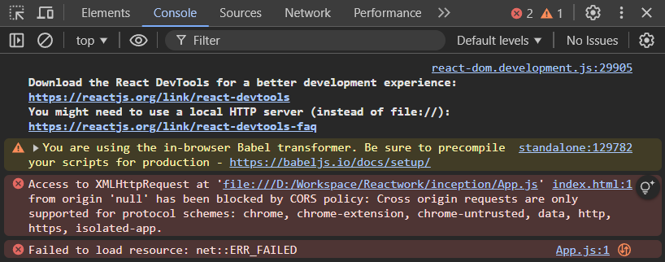

## Message
In the previous commit, we built a simple web page using HTML code that prints `Hello World!`.

Now, we will achieve the same result, printing the `Hello World!` text on the web page, using only JavaScript under the `root` id.

As we already know, every browser has its own JavaScript engine, capable of running HTML and JavaScript code easily.

However, browsers are not capable of running React code natively until you configure React manually.

There are several ways to configure React so that the browser can understand it.

One way is by using [React CDN links](https://legacy.reactjs.org/docs/cdn-links.html), which can be added to our code to connect the browser to the network where the React library is hosted, enabling the browser to understand React code natively.

```js
<script crossorigin src="https://unpkg.com/react@18/umd/react.development.js"></script>
<script crossorigin src="https://unpkg.com/react-dom@18/umd/react-dom.development.js"></script>
```
Let's write the same `Hello World!` message on the web page using React.

## Assignment

Create a complex HTML element using React inside `root` id element. The element should include a heading, a paragraph, and an unordered list with three list items.

```html
    <div>
        <h1 class="heading">Namaste React 🙏</h1>
        <p>This is a paragraph inside a complex element.</p>
        <ul>
            <li>Item 1</li>
            <li>Item 2</li>
            <li>Item 3</li>
        </ul>
    </div>
```

### Answer

```javascript
    const element = React.createElement(
        'div',
        null,
        React.createElement('h1', { className: 'heading' }, 'Namaste React 🙏'),
        React.createElement('p', null, 'This is a paragraph inside a complex element.'),
        React.createElement(
            'ul',
            null,
            React.createElement('li', null, 'Item 1'),
            React.createElement('li', null, 'Item 2'),
            React.createElement('li', null, 'Item 3')
        )
    );

    const root = ReactDOM.createRoot(document.getElementById('root'));
    root.render(element);
```

There is several common challenge with pure javaScript react-code:
- As you can see now that the simplest html structure is written in this way is such a complex thing to do.
- The code you've shared is the way React components are traditionally written using `React.createElement()` calls. While this approach works, it can quickly become cumbersome and difficult to manage, especially for larger projects. Here’s why:

- As you can see, each HTML tag (like `<div>`, `<h1>`, etc.) requires a separate `React.createElement()` call, making the code lengthy and harder to read.
- The code becomes increasingly harder to manage as components grow larger. It’s not intuitive to maintain, especially when handling more complex layouts or adding additional logic.
- Tracking down issues in this format can be more difficult, and seeing the structure visually in the code isn't as clear as HTML syntax.

React, in its core form, relies on `React.createElement()` to create the virtual DOM, but this style of writing can be a deterrent for developers, especially as projects grow.

To simplify this process, React introduced JSX (JavaScript XML). JSX is a syntax extension for JavaScript that allows you to write HTML-like code inside JavaScript. It provides a more declarative, readable, and maintainable way to write React components.

```javascript
const element = (
  <div>
    <h1 className="heading">Namaste React 🙏</h1>
    <p>This is a paragraph inside a complex element.</p>
    <ul>
      <li>Item 1</li>
      <li>Item 2</li>
      <li>Item 3</li>
    </ul>
  </div>
);

const root = ReactDOM.createRoot(document.getElementById('root'));
root.render(element);
```
But befor running your project, we have need to configure Babel CDN for transpiling JSX.

When you use React via a CDN (Content Delivery Network), you are essentially loading external scripts (like React and ReactDOM) into your project. If you try to open your index.html directly in a browser (by double-clicking the file), it is loaded using the file:// protocol, which means the browser treats the local file system as a separate origin.



To avoid CORS issues, it's best to serve your project using an HTTP server (e.g. node:http-server, live-server by vscode-extension). This ensures that your project is loaded over a valid protocol and avoids conflicts with the same-origin policy.

With JSX, you can write the UI structure in a more familiar format — similar to HTML — and React will automatically convert it into `React.createElement()` calls under the hood. This allows you to write clean, concise, and readable code.

As we know that at the core, all React code is ultimately just JavaScript. Whether you're using JSX or directly writing JavaScript (like with React.createElement()), it all compiles down to JavaScript that the browser can execute.
