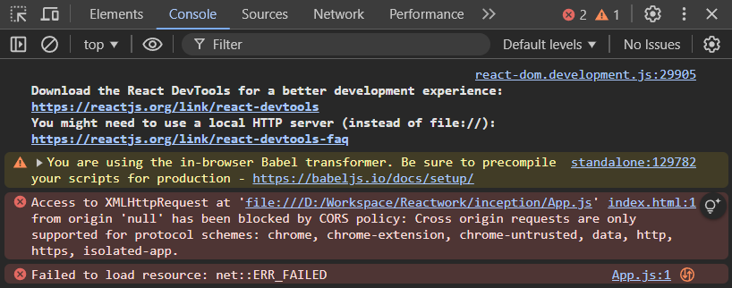

## Message
In the previous commit, we built a simple web page using HTML code that prints `Hello World!`.

Now, we will achieve the same result, printing the `Hello World!` text on the web page, using only JavaScript under the `root` id.

As we already know, every browser has its own JavaScript engine, capable of running HTML and JavaScript code easily.

However, browsers are not capable of running React code natively until you configure React manually.

There are several ways to configure React so that the browser can understand it.

One way is by using [React CDN links](https://legacy.reactjs.org/docs/cdn-links.html), which can be added to our code to connect the browser to the network where the React library is hosted, enabling the browser to understand React code natively.

```js
<script crossorigin src="https://unpkg.com/react@18/umd/react.development.js"></script>
<script crossorigin src="https://unpkg.com/react-dom@18/umd/react-dom.development.js"></script>
```
Let's write the same `Hello World!` message on the web page using React.

## Assignment

Create a complex HTML element using React inside `root` id element. The element should include a heading, a paragraph, and an unordered list with three list items.

```html
    <div>
        <h1 class="heading">Namaste React 🙏</h1>
        <p>This is a paragraph inside a complex element.</p>
        <ul>
            <li>Item 1</li>
            <li>Item 2</li>
            <li>Item 3</li>
        </ul>
    </div>
```

### Answer

```javascript
    const element = React.createElement(
        'div',
        null,
        React.createElement('h1', { className: 'heading' }, 'Namaste React 🙏'),
        React.createElement('p', null, 'This is a paragraph inside a complex element.'),
        React.createElement(
            'ul',
            null,
            React.createElement('li', null, 'Item 1'),
            React.createElement('li', null, 'Item 2'),
            React.createElement('li', null, 'Item 3')
        )
    );

    const root = ReactDOM.createRoot(document.getElementById('root'));
    root.render(element);
```

There is several common challenge with pure javaScript react-code:
- As you can see now that the simplest html structure is written in this way is such a complex thing to do.
- The code you've shared is the way React components are traditionally written using `React.createElement()` calls. While this approach works, it can quickly become cumbersome and difficult to manage, especially for larger projects. Here’s why:

- As you can see, each HTML tag (like `<div>`, `<h1>`, etc.) requires a separate `React.createElement()` call, making the code lengthy and harder to read.
- The code becomes increasingly harder to manage as components grow larger. It’s not intuitive to maintain, especially when handling more complex layouts or adding additional logic.
- Tracking down issues in this format can be more difficult, and seeing the structure visually in the code isn't as clear as HTML syntax.

React, in its core form, relies on `React.createElement()` to create the virtual DOM, but this style of writing can be a deterrent for developers, especially as projects grow.

To simplify this process, React introduced JSX (JavaScript XML). JSX is a syntax extension for JavaScript that allows you to write HTML-like code inside JavaScript. It provides a more declarative, readable, and maintainable way to write React components.

```javascript
const element = (
  <div>
    <h1 className="heading">Namaste React 🙏</h1>
    <p>This is a paragraph inside a complex element.</p>
    <ul>
      <li>Item 1</li>
      <li>Item 2</li>
      <li>Item 3</li>
    </ul>
  </div>
);

const root = ReactDOM.createRoot(document.getElementById('root'));
root.render(element);
```
But befor running your project, we have need to configure Babel CDN for transpiling JSX.

When you use React via a CDN (Content Delivery Network), you are essentially loading external scripts (like React and ReactDOM) into your project. If you try to open your index.html directly in a browser (by double-clicking the file), it is loaded using the file:// protocol, which means the browser treats the local file system as a separate origin.



To avoid CORS issues, it's best to serve your project using an HTTP server (e.g. node:http-server, live-server by vscode-extension). This ensures that your project is loaded over a valid protocol and avoids conflicts with the same-origin policy.

With JSX, you can write the UI structure in a more familiar format — similar to HTML — and React will automatically convert it into `React.createElement()` calls under the hood. This allows you to write clean, concise, and readable code.

As we know that at the core, all React code is ultimately just JavaScript. Whether you're using JSX or directly writing JavaScript (like with React.createElement()), it all compiles down to JavaScript that the browser can execute.

**Babel** is a JavaScript compiler that is primarily used to convert modern JavaScript code (including newer ECMAScript features) into a version of JavaScript that is compatible with a wider range of web browsers, particularly older ones. Babel is also commonly used to transpile JSX (which is used by React) into standard JavaScript that browsers can execute.

To use JSX in your React project, you need to set up Babel to transpile JSX code into JavaScript. This can be done by configuring Babel with a preset that includes the necessary plugins to handle JSX syntax.

## Why Do We Need Babel?

JavaScript is constantly evolving, with new features and syntax being introduced in newer versions of the language. However, not all browsers support the latest features. For instance:

- Arrow functions (`() => {}`)
- Async/await syntax
- Destructuring assignment
- Template literals (`${}`)
- Classes (`class MyClass {}`)
- Modules (`import/export`)

    . . . and many more.

Older browsers, such as Internet Explorer, do not support some of the newer JavaScript features. This can create compatibility issues when you're trying to use the latest JavaScript in your app.

Babel solves this problem by transpiling (or transforming) the modern JavaScript code into an older, more widely supported version of JavaScript. This ensures that your code can run across all browsers, even if they don't support the latest features.

Additionally, Babel is also used to convert JSX into regular JavaScript code that React can understand.

The most common preset used for React projects is `@babel/preset-react`, which includes the plugins needed to transform JSX syntax into JavaScript. You can install this preset using npm:

```bash
npm install --save-dev @babel/preset-react
```

After adding npm configuration to our project, the most important package for our React project is the bundler. A bundler is responsible for processing, bundling, and optimizing your code and assets. It takes multiple source files (JavaScript, CSS, images, etc.) and combines them into a smaller number of output files, improving performance and reducing load times.

For now, we'll set up Parcel as the bundler for our React project. Parcel is a zero-config bundler, which means it doesn't require a lot of manual setup compared to Webpack. It automatically handles features like bundling, minification, and code transformation with little configuration.

```bash
npm install --save-dev parcel
```

Using React via a CDN (Content Delivery Network) for a production project is not (the best approach) the ideal way to configure React. While it may seem like a quick and easy solution, there are several reasons why it is not recommended for most cases:

- When you use a CDN to include React, you are relying on an external server for the specific version of React and ReactDOM. This can lead to issues if the version you are using gets updated or if there are breaking changes in the future.

- Serving React from a CDN means the browser has to make an external request every time to fetch the library. This adds latency and can negatively affect performance, especially in production environments.

- When you use a bundler like Parcel, Webpack, or Vite, you can bundle React with your application code, optimizing the final build by minimizing and tree-shaking the code. If you use a CDN, you miss out on these performance optimizations.

- With a CDN, it's harder to control the caching strategy and manage different versions of React across multiple environments (development, staging, production).

For a more efficient, scalable, and production-ready setup, it's better to install React and ReactDOM via npm from the npm registry, allowing you to manage versions and dependencies effectively.

```bash
npm install react react-dom
npm install --save-dev parcel # if you're using Parcel as the bundler and haven't installed it yet
```
- `react` and `react-dom`: The core libraries needed for a React project.
- `parcel`: The bundler that will package and optimize our code for development and production.

With all these configurations in place, you can now write React code using JSX and modern JavaScript syntax, and the bundler will take care of transpiling and bundling the code for you.

- Create the following folder structure for your project (Optional):

```bash
namaste-react/
├── src/
│   ├── index.js
├── public/
│   ├── index.html
├── package.json
```
or you can go with the existing folder structure of your project, but better to keep the source code in a separate folder (like `src/`) and the public files in another folder (like `public/`).

After installing React and ReactDOM, you can import them into your JavaScript file using ES modules:

```javascript
import React from 'react';
import ReactDOM from 'react-dom';
```

Make sure, you include the following script tag in your `index.html` file to load the JavaScript file:

```html
<script src="src/index.js" type="module"></script>
```

**Note:** The `type="module"` attribute is used to indicate that the script is a module, allowing you to use ES modules in your JavaScript code.

## What `parcel` does for us?
If our react application is fast, then somehow bundler is also responsible, as it's doing a lot of work behind the scenes. The bundler is responsible for processing, bundling, and optimizing your code and assets.

Parcel does the following things for us:
- Bundling
- Lazy dev builds
- Dev Server
- Diagnostic messages
- Hot module replacement (HMR)
- Code splitting
- Minification
- Transpilation (using Babel)
- CSS preprocessing
- Image optimization
- Compression
- Caching - Faster rebuilds
- File Watching Algorithm
- Content Hashing
- Differential Bundling - support for older browsers and modern browsers separately.
- Workers - Web Workers, Service Workers and worklets.
- Tree Shaking - removing unused code
- Named pipelines - for customizing the build process

for more information, you can visit the official [Parcel website](https://parceljs.org/).

As we normally work on development mode, we can run the following command to start the development server:

```bash
npx parcel public/index.html
```
- This will start the development server and open your project in the browser. You can make changes to your code, and Parcel will automatically rebuild and reload the page.

But if you want to build your project for production, you can run the following command:

```bash
npx parcel build public/index.html
```
- This is recommended to use a bundler like Parcel, Webpack, or Vite for your React projects, as they provide a more efficient and optimized way to bundle your code for production.
- As a result, building the project may take slightly more time compared to the development server, but this is beneficial, as it produces a highly optimized and efficient build for the project.

You can also do the same thing using the `package.json` file by adding the following scripts:

```json
{
  "scripts": {
    "start": "parcel public/index.html", // for development
    "build": "parcel build public/index.html" // for production
  }
}
```

You can also configure the `browserslist` in your `package.json` file to specify which browsers your project should support.

More, you can visit the official [Browserslist website](https://browserslist.dev/), where you can generate a `browserslist` configuration based on your project requirements.

```json
{
  "browserslist": [
    "last 2 versions",
    "> 1%"
  ]
}
```

After completing a series of steps, we successfully create our own React project, similar to the one generated by the create-react-app tool.
